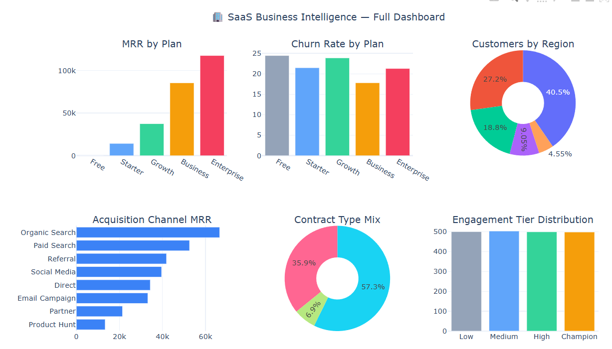

# 📊 SaaS Business Intelligence — Data Analysis Portfolio


## 🎯 Project Overview
End-to-end data analysis project on a B2B SaaS business dataset (2,000+ customers).
Covers the full analytics pipeline from raw dirty data to interactive dashboards.

## 📁 Dataset
- **2,010 rows × 22 columns** — synthetic but realistic SaaS customer data
- Intentionally includes dirty data: mixed date formats, $ prefixes, inconsistent casing, duplicates, missing values

## 🛠️ Skills Demonstrated

| Category | Skills |
|---|---|
| Data Loading | read_csv, dtypes, shape, info, describe |
| Data Cleaning | drop_duplicates, str.strip, mixed date parsing, fillna, astype |
| Feature Engineering | tenure, cohort month, ARR, LTV, pd.cut, pd.qcut |
| GroupBy & Agg | named aggregations, multi-level groupby, transform, apply |
| Advanced Analysis | Cohort retention, MRR waterfall, RFM segmentation, rolling averages |
| Visualization | Matplotlib subplots, Seaborn heatmap, Plotly interactive dashboard |

## 📊 Key Analyses
- ✅ MRR & ARR breakdown by Plan / Region / Industry
- ✅ Churn rate analysis with survival stats
- ✅ Monthly cohort retention heatmap
- ✅ MRR Waterfall (New / Expansion / Churned)
- ✅ RFM Customer Segmentation
- ✅ Interactive Plotly Dashboard (6-panel)
- ✅ Correlation matrix of key SaaS metrics

## 🚀 How to Run
\```bash
git clone https://github.com/mohammadArifulislam/python_project_portfolio.git
cd saas-data-analysis-portfolio
pip install -r requirements.txt
jupyter notebook notebooks/SaaS_Analysis_Portfolio_Projects.ipynb
\```

## 📸 Dashboard Preview

